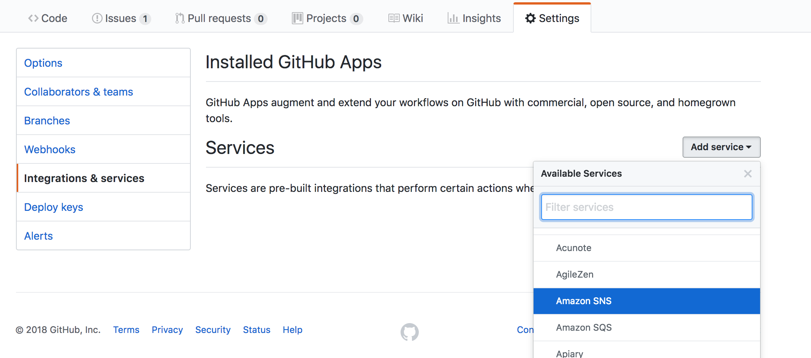
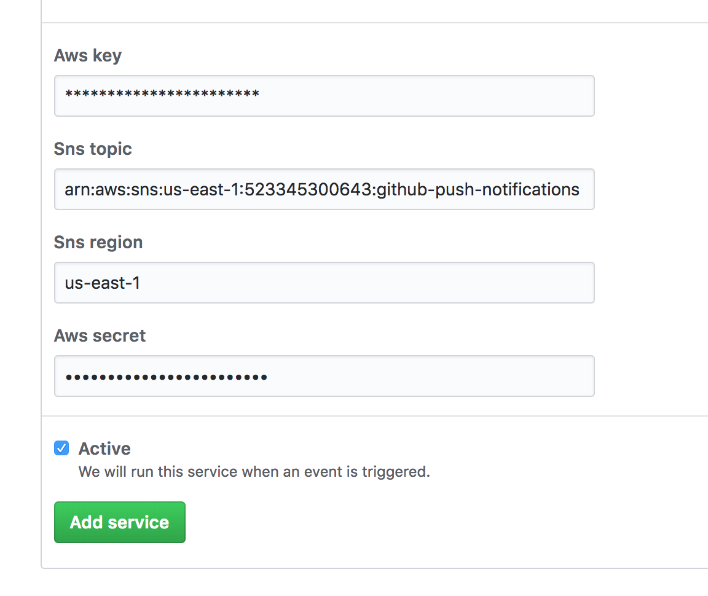
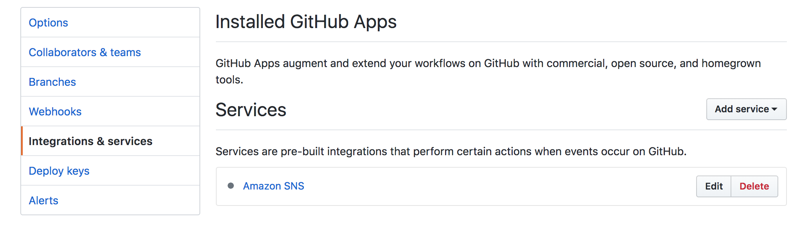
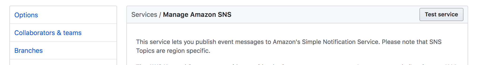
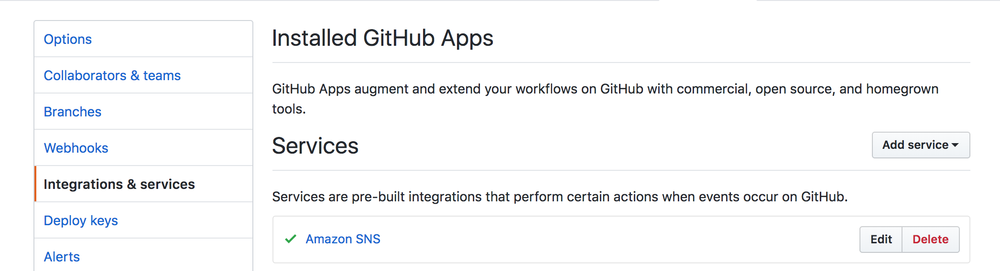

# How to enable DG yaml checking in your code repo

To enable your github repo for standard metadata checking, you need to push a notification to our validation service & enable access to write status back to your repo.

# Step 1: Enable SNS Hook

Go to the settings page on your github repo, choose "Integrations & Services", and choose "Amazon SNS":



For the SNS topic, enter this value: ```arn:aws:sns:us-east-1:523345300643:github-push-notifications```.
For the SNS region, enter this value: ```us-east-1```.  For the AWS credentials, contact nricklin@digitalglobe.com.  



Click the "Add Service" button, and you'll see that "Amazon SNS" is listed as an installed service:



Click on "Amazon SNS" and then click on the "Test Service" button to verify that it all works:



If everything is working fine, you'll see a green checkmark:



# Step 2: Give Access to your Repo

# Step 3: 
